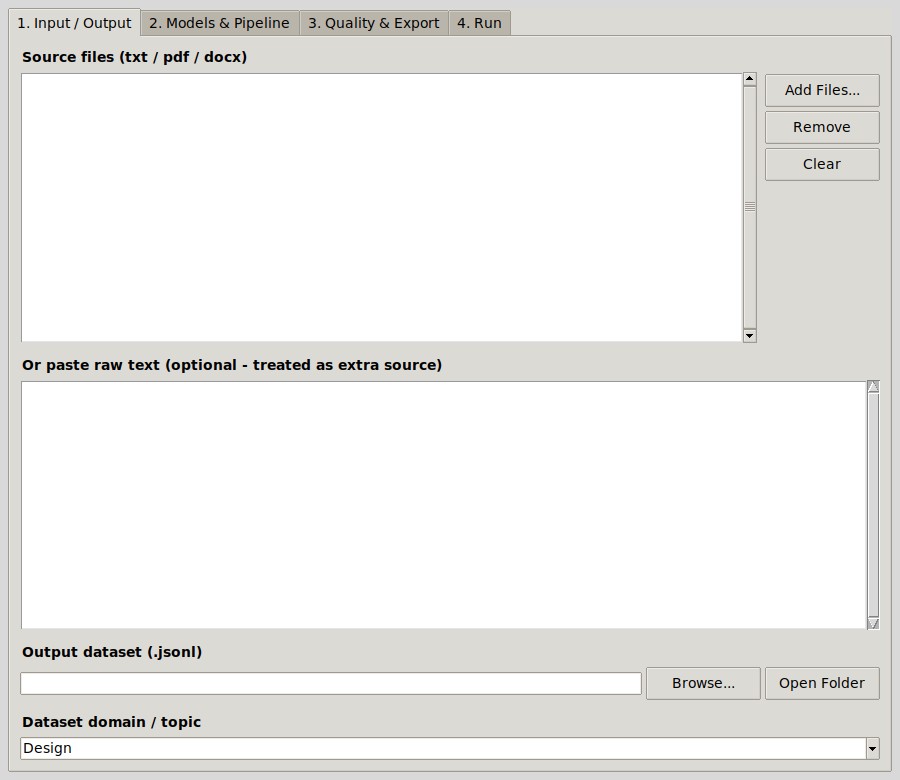

# Design Dataset Forge

Desktop tool that turns design documents (PDF, DOCX, TXT) into instruction-tuning datasets for fine-tuning a small model on industrial design. Runs fully local on Ollama.



## Pipeline

For each chunk of text:

1. analyze: pull out facts, terms, definitions
2. route: a small model decides if the chunk is usable and which task types fit
3. generate: a bigger model writes question/answer pairs grounded in the chunk
4. validate: a second model scores grounding and completeness (0-6 rubric)
5. clean and dedupe
6. export as ShareGPT or Alpaca with train/val/test split

Also writes `quality_report.json` with score histogram and per-task stats.

## Files

| | |
|---|---|
| `dataset_forge.py` | main app (v2) |
| `dataset_exporter.py` | first version, router/generator/validator only |
| `evaluate_baseline.py` | zero-shot score of a model on the test split |
| `train.py` | LoRA fine-tune with Unsloth |
| `examples/sample_dataset.jsonl` | small sample output |

## Run

Needs [Ollama](https://ollama.com) running with a couple of models pulled, e.g.:

```
ollama pull qwen2.5-coder
ollama pull gemma3:12b
pip install PyPDF2 python-docx requests simhash
python dataset_forge.py
```

Baseline before training:

```
python evaluate_baseline.py --dataset dataset_test_sharegpt.jsonl --model gemma3:12b
```

Training (needs a CUDA GPU):

```
pip install unsloth trl datasets
python train.py
```

## Notes

- qwen3 models need `"think": false` in the request, otherwise the JSON comes back wrapped in reasoning text.
- The validator was too strict at first and threw away most pairs; thresholds are tuned in the code.

## License

MIT
